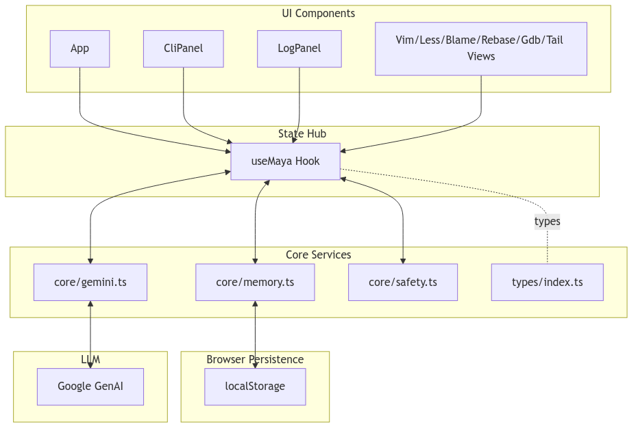

# Run and deploy your AI Studio app

[](.github/copilot-instructions.md)

This contains everything you need to run your app locally.

## Getting Started

Prerequisites: Node.js (LTS recommended)

1. Install dependencies
   
   npm install

2. Configure environment
   
   Create a file named `.env.local` in the project root with:
   
   VITE_GEMINI_API_KEY=your_api_key_here

3. Run the dev server
   
   npm run dev

The app will start with Vite and print a local URL to open in your browser.

## Build and Preview

- Build for production
  
  npm run build

- Preview the production build locally
  
  npm run preview

## Scripts

- dev: Start Vite dev server
- build: Build production assets
- preview: Preview the built app locally

## Notes

- Environment variables must use the `VITE_` prefix to be available in the browser. This app reads `import.meta.env.VITE_GEMINI_API_KEY`.
- If the key is missing, Gemini-backed features will log a warning and Gemini calls will throw lazily when invoked.

## Testing

This project uses Vitest + Testing Library with a jsdom environment.

- Run all tests once:
  
  npm run test

- Run tests in watch mode:
  
  npm run test:watch

Mocking highlights:
- Gemini calls are mocked in tests via `vi.mock('../core/gemini')` so no real API access is required.
- Persistence helpers in `src/core/memory.ts` are mocked per test when needed to isolate state.
- LocalStorage is replaced with an in-memory mock during tests.
- Example tests:
  - `src/__tests__/memory.test.ts` verifies capping and persistence for usage and audit histories.
  - `src/__tests__/useMaya.audit.test.tsx` runs the Audit flow end-to-end with mocked Gemini.
  - `src/__tests__/useMaya.audit-clear.test.tsx` confirms Clear Audit History behavior with a confirm dialog.
  - `src/__tests__/maya-explain.test.tsx` verifies the new `maya explain <path>` flow and Explain History persistence.

## Feature Roadmap

### Current Features
- CLI `maya audit` command with Gemini API integration
- Audit History panel with localStorage persistence and UI controls
- New CLI `maya explain <path>` command (mocked) with Explain History panel and persistence
- Comprehensive test coverage with Vitest and mocks

### Next Steps
- Expand Maya’s safe subcommands (e.g., optimize)
- UI trigger buttons for common commands
- Exportable audit/history logs

### Future Vision
- Plugin architecture for 3rd party integrations
- Support for multiple LLM backends and seamless switching
- Enhanced live views: AI-assisted vim operations, live dashboards, etc.

## Screenshots and Demo GIF

- CLI panel: 
- Audit History panel: 
- Quickstart demo (GIF): 

## Quick Start Video/GIF

A short screencast (~10–20 seconds) showing:

1. Starting the development server (`npm run dev`)
2. Running the command `maya audit` in the CLI
3. Opening the Secondary Display to view the Audit History panel

You can also use the generated GIF: `images/quickstart.gif`.

### maya explain <path>

- Safe subcommand that analyzes a file and outputs a JSON explanation. Example output shape:

```
{
  "file": "src/index.ts",
  "summary": "Entry point",
  "details": ["Bootstraps app", "Renders root"]
}
```

- History is saved and visible under the Explain History panel in the Secondary Display.

## FAQ / Troubleshooting

**Q:** I get an error about missing `VITE_GEMINI_API_KEY`  
**A:** Create a `.env.local` file with your Gemini API key:

```
VITE_GEMINI_API_KEY=your_api_key_here
```

- "process.env not found": use `import.meta.env.VITE_*` in browser code.
- "Tests fail to find vitest/jsdom": run `npm install`; use `npm run test`.
- "Simulated outputs look odd": ensure `config.gemini_enabled` is true; retry.

## Architecture Diagram (TODO)
- Mermaid stub: see `docs/architecture.md`.
- Diagram image: 

## AI Contributor Guidance

See `.github/copilot-instructions.md` for architecture, conventions, command routing, and how to add new `maya` subcommands (with a working `maya audit` example). The file is the source of truth for AI coding agents and should be kept up to date.
